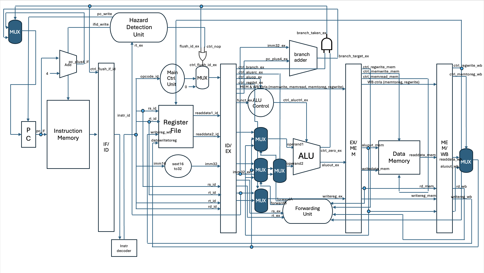

# 🧠 MIPS 5-Stage Pipeline (IF–ID–EX–MEM–WB)

A simple **MIPS 5-stage pipelined CPU** implemented in Verilog.

**Branch:** `main` (with data forwarding and untaken branch prediction)

---

##  Pipeline Overview


---

## ⚙️ Features

- **Classic 5 pipeline stages:** IF → ID → EX → MEM → WB  
- **Branch decision** handled in the **EX** stage  
  → Misprediction causes a **2-cycle flush** (IF/ID and ID/EX)  
- **Data forwarding** between EX/MEM/WB stages to reduce stalls  
- **Testbench** dumps VCD waveform and data memory contents automatically  
- **Modular design:** each unit (ALU, control, hazard, forwarding, etc.) is implemented in a separate file  

---

##  Supported Instructions (Subset)

| Type | Instructions |
|------|---------------|
| **ALU** | `add`, `addi`, `sub`, `and`, `or`, `nor`, `slt`, `sll` |
| **Memory** | `lw`, `sw` |
| **Branch** | `beq` |

---

##  Initialization & Memory

- **Register file (`reg_file.v`)**  
  - Contains predefined register values for easier testing.  
  - You can modify initial values directly inside `reg_file.v`.

- **Instruction memory**  
  - Loads programs from `program.hex` using `$readmemh` in `instr_mem.v`. 
  - Example files: `program1.hex`, `program2.hex`, `program3.hex`  
  - Human-readable decoded versions: `program1.txt`, `program2.txt`, `program3.txt` (in `memory/` folder)
  - **Please implement this in `instr_mem.v`.**


- **Data memory**  
  - Dumped automatically to `memory_dump.hex` at the end of simulation via `$writememh`.

---

##  Build & Run

```bash
make         # build with iverilog
make run     # run with vvp
make wave    # open VCD file with GTKWave
make clean   # remove build artifacts
```

## Verified tools
- **Icarus Verilog runtime**: 12.0 (stable)  
- **GTKWave**: v3.4.0 (w)1999–2022 BSI


## 📘 Notes  
> These codes are not necessarily optimized for efficiency.
Each unit is implemented in a modular and readable manner for clarity.
Refer to the pipeline diagram for the big picture.

> Based on Computer Organization and Design, MIPS Edition
by David A. Patterson & John L. Hennessy (5th Edition).


