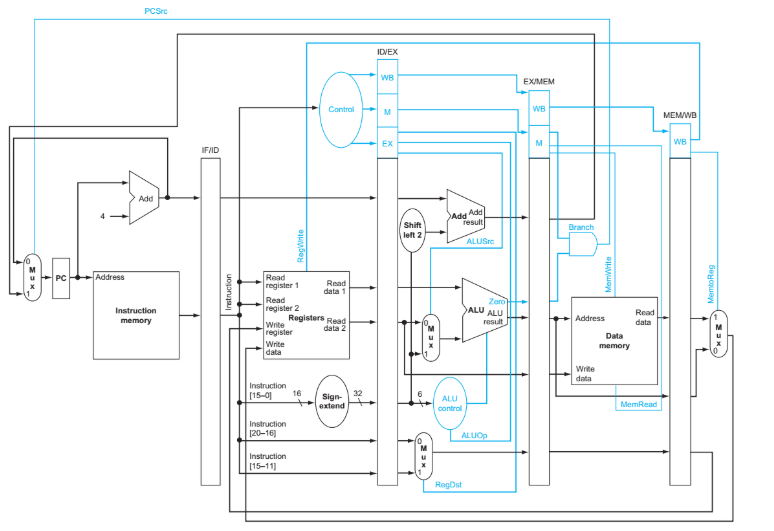

# MIPS 5-Stage Pipeline (IF–ID–EX–MEM–WB)

A simple MIPS 5-stage pipelined CPU.

**Branch:** `basic_pipeline` (no forwarding, no branch prediction)

## Pipeline Diagram


---

## Features
- Classic 5 stages: **IF → ID → EX → MEM → WB**
- **No forwarding**, **no branch prediction**
- Branch decision currently in **MEM** stage (fall-through needs flush)
- Testbench dumps **VCD** and data memory

---

## Supported Instructions (subset)
- ALU: `add`, `addi`, `sub`, `and`, `or`, `nor`, `slt`
- Memory: `lw`, `sw`
- Branch: `beq`

> Notes  
> - `nop` is typically `sll $zero,$zero,0`, but this branch does not rely on `sll` control.  
> - With **no forwarding/hazard unit**, software scheduling (or NOPs) is required for correctness.

---

## Directory Layout 
cpu.v \
instr_mem.v \
data_mem.v \
reg_file.v \
ctrl_main.v \ 
ctrl_alu.v \
alu32.v \
branch_adder.v \
pipe_if_id.v \
pipe_id_ex.v \
pipe_ex_mem.v \
pipe_mem_wb.v \
cpu_tb.v \
Makefile \
README.md \
memory/ \
program.hex # machine code executed by instr_mem \
program.asm # assembly version of program.hex \
memory_dump.hex # data memory dump at end of sim \


---

## Initialization & Memory
- **Register file** (`reg_file`) sets some **initial register values** (for convenience in tests).
- **Instruction memory** loads **`program.hex`** via `$readmemh`.
- **Data memory** is dumped to **`memory_dump.hex`** at the end of simulation via `$writememh`.


---

## Build & Run
**Makefile targets:**

```bash
make         # build with iverilog
make run     # run with vvp
make wave    # open VCD with GTKWave
make clean   # remove build artifacts
```


---


## Verified tools
- **Icarus Verilog runtime**: 12.0 (stable)  
- **GTKWave**: v3.4.0 (w)1999–2022 BSI

## Sample Program (from `program.hex`)
20090002 addi $t1,$zero,2 \
012A5820 add $t3,$t1,$t2 \
018D5822 sub $t3,$t4,$t5 \
01F87024 and $t6,$t7,$t8 \
012AC825 or $t9,$t1,$t2 \
AD090000 sw $t1,0($t0) \
8D180000 lw $t8,0($t0) \
2129FFFF addi $t1,$t1,-1 \
2318000A addi $t8,$t8,10 \
11200002 beq $t1,$zero,+2 \
1000FFF6 beq $zero,$zero,-10 \


**Behavior:** uses `$t1` as a loop counter; loop body executes **exactly 2 times**, then exits.

## Pipeline Caveats (`basic_pipeline`)
- **No hazard unit:** ensure **≥ 2 independent instructions** between producer and consumer.
  - RAW (reg write → next reads)
  - **load-use** (`lw` → next uses): keep at least **2 cycles** of separation
- **Branch decision in MEM:** flush **IF/ID** (and usually **ID/EX**) on taken branches.
- Consider adding a **reset (`rst`)** and initializing **IMEM to NOPs** to get clean first fetches.

